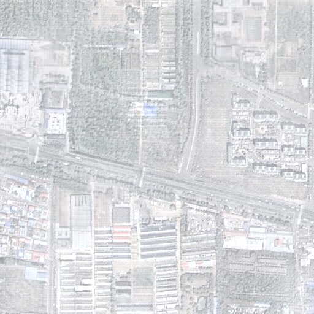

###  An Encoder-free and Decoder-free Framework for Efficient Remote Sensing Image Dehazing

**Abstract**: Haze obscures remote sensing images, hindering valuable information extraction. Although Existing approaches greatly advance this endeavor, they often rely on conventional heavy encoder-decoder architectures, which consequently results in extended inference durations. To this end, we propose FasterRSD-Net, an encoder-free and decoder-free framework for efficient remote sensing image dehazing. The primary objective of our study is to shift the emphasis away from encoders and decoders and instead concentrate on skip connections to develop a more hierarchical-meeting architecture. Furthermore, regarding the process of merging features within the same level, we develop an innovative module called the intra-level transposed fusion module (ITFM). This module employs adaptive transposed self-attention to capture comprehensive context-aware information, facilitating the robust feature fusion. Meanwhile, we present a cross-level multi-view interaction module (CMIM) to enable effective interactions between features from various levels, which aims to mitigate the loss of information that often occurs due to repeated sampling operations. In addition, we propose a multi-view progressive extraction block (MPEB) that partitions the features into four distinct components and employs convolution with varying kernel sizes, groups, and dilation factors to facilitate view-progressive feature learning. This approach improves the feature extraction while reducing computational complexity. Extensive experiments demonstrate the superiority of our proposed FasterRSD-Net over the current state-of-the-art methods on eight public datasets and our collected real-world dataset. We release the source code and all pre-trained models at https://github.com/chdwyb/FasterRSD-Net.

### News 🚀🚀🚀

- **July 21, 2023**: We have identified the underlying reasons behind DehazeFormer's production of low-quality images with high metric scores. The subsequent code present in `test.py` file leads to suboptimal visual outcomes. Moreover, we provide two illustrative examples to substantiate this finding.

  ```python
  # [-1, 1] to [0, 1]
  output = output * 0.5 + 0.5
  target = target * 0.5 + 0.5
  ```

  |  |  |
  | :--------------------------------------------: | :--------------------------------------------------: |
  |  **With the transform of [-1, 1] to [0, 1]**   |    **Without the transform of [-1, 1] to [0, 1]**    |


### Requirements

```python
python 3.8.6
torch 1.9.0
torchvision 0.11.0
pillow 9.2.0
scikit-image 0.19.3
timm 0.6.7
tqdm 4.64.0
opencv-python 4.5.2.54
```

### Train

If you intend to conduct training on our proposed FasterRSD-Net using your own datasets, it is imperative to initially ascertain the training and testing paths specified in `options.py`. Specifically, the paths should be provided in the manner illustrated below.

```python
# training
self.Input_Path_Train = './Haze1k-thick/train/hazy/'
self.Target_Path_Train = './Haze1k-thick/train/gt/'
# validation
self.Input_Path_Val = './Haze1k-thick/val/hazy/'
self.Target_Path_Val = './Haze1k-thick/val/gt/'
```

Subsequently, you may attempt the execution of the following command in order to initiate the training process.

```python
python train.py
```

### Pre-trained models

To facilitate expeditious testing on the datasets utilized in our study, we additionally furnish all the pre-trained models for the purpose of any conceivable verification.

| Dataset           | Link                                                         | Dataset              | Link                                                         |
| ----------------- | ------------------------------------------------------------ | -------------------- | ------------------------------------------------------------ |
| StateHaze1K-thick | [[Baidu Cloud](https://pan.baidu.com/s/1KGz0Lyo6E3mDJBSdDzFfgg), code: rsid]   [[Google Drive](https://drive.google.com/file/d/1Leyg1sw4x48wEo5zsPKBGtVaCF5NWdY_/view?usp=sharing)] | StateHaze1K-moderate | [[Baidu Cloud](https://pan.baidu.com/s/1cyzLZFK0-pX-uyUC3yTAXQ), code: rsid]   [[Google Drive](https://drive.google.com/file/d/1Jxz0ZpMUAFYP-4nYS4__HyxR506_kF7d/view?usp=sharing)] |
| StateHaze1K-thin  | [[Baidu Cloud](https://pan.baidu.com/s/16rhnMKq47mqlgZ5hYE_bLw), code: rsid]   [[Google Drive](https://drive.google.com/file/d/15FeoHGhfRSk22zWzWfH96mHIjjnoHb-z/view?usp=sharing)] | RS-Haze              | [[Baidu Cloud](https://pan.baidu.com/s/11CQE01WXtxGX9bdigkiMJg), code: rsid]   [[Google Drive](https://drive.google.com/file/d/1-UD3eJeAULBB4mzf3SvNMdzAvuSLFK9G/view?usp=sharing)] |
| LHID              | [[Baidu Cloud](https://pan.baidu.com/s/1rF3eYJ6f7s5mVmIO9NriQg), code: rsid]   [[Google Drive](https://drive.google.com/file/d/1L0yDz4aP5NfNetqSmHC1CV7GiL45b8nK/view?usp=sharing)] | DHID                 | [[Baidu Cloud](https://pan.baidu.com/s/1n9uh8daqVDmFkkr3skQw9A), code: rsid]   [[Google Drive](https://drive.google.com/file/d/14RSfxdepbhaLBmPfryzCc1erGn1cjrOn/view?usp=sharing)] |
| RICE              | [[Baidu Cloud](https://pan.baidu.com/s/1IdaugM5MrxH8QMFeT6sy4g), code: rsid]   [[Google Drive](https://drive.google.com/file/d/1FsABBJRbUA0mJbzsjMlMofI7exe5T82D/view?usp=sharing)] | RSID                 | [[Baidu Cloud](https://pan.baidu.com/s/12cZt2e4p85u2n59pYZ-rvw), code: rsid]   [[Google Drive](https://drive.google.com/file/d/1HozsEo2H49SpRMb0ws1VBULqUevSpboA/view?usp=sharing)] |
| Dense-Haze        | [[Baidu Cloud](https://pan.baidu.com/s/1KM6QneCvYZ_Bh0nCP6Eh5Q), code: rsid]   [[Google Drive](https://drive.google.com/file/d/1h83Gcy9Z4ET1m5Jw-b15HR4h9x4hWk_h/view?usp=sharing)] | NH-Haze              | [[Baidu Cloud](https://pan.baidu.com/s/15pzjMIT2IjzjDlUTIMcZ1g), code: rsid]   [[Google Drive](https://drive.google.com/file/d/13vqNv1SzIt1bxEsSYjl_Y5zAYXKfLbLn/view?usp=sharing)] |

### Test

To assess the effectiveness of our proposed FasterRSD-Net on your personalized datasets, it is imperative to initially identify the testing paths delineated in the `options.py` file. For instance, the paths should be specified in the following format.

```python
# testing
self.Input_Path_Test = './Haze1k-hick/test/hazy/'
self.Target_Path_Test = './Haze1k-hick/test/gt/'
self.Result_Path_Test = './Haze1k-hick/test/result/'
```

Subsequently, it may be necessary to modify the path of the pre-trained model as illustrated below.

```python
#  pre-trained model
self.MODEL_PRE_PATH = './rs_haze.pth'
```

Now you can proceed with the testing phase and assess the performance of our proposed FasterRSD-Net.

```pyth
python test.py
```

### Dataset

If you intend to conduct experiments on our collected real-world remote sensing hazy dataset, named RRSD300, please download it from [[Baidu Cloud](https://pan.baidu.com/s/1lM9vEvDwgDrCoyPJAW490A), code: rsid] or [[Google Drive](https://drive.google.com/file/d/198dmAL5Vrw1qm_f5t4nW8l1Jmw-HNLuy/view?usp=sharing)].

### Contact  us

This repository is currently under preparation. If you have any inquiries or questions regarding our work, please feel free to contact us at wyb@chd.edu.cn.
